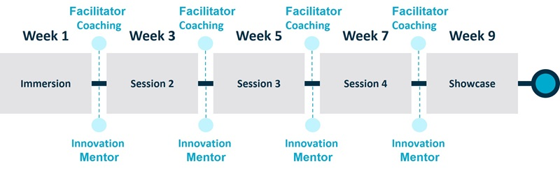

## The Hypersocks Team
### ON Prime 15 CSIRO Innovation Program

[ON Prime](https://www.csiro.au/en/work-with-us/funding-programs/innovation-programs/on-prime)
gives researchers the skills and confidence to undertake customer
discovery and market validation activities that enable them to take their
research further.

ON Prime is a free program designed to help research teams of two to five
people take their projects to the next level through customer discovery
activities and more. We work with researchers at any stage of their project
across all disciplines.

During the nine weeks of ON Prime, you will develop a deeper understanding of
the people who could benefit the most from your research and sharpen your
skills to communicate with that audience.

Expert facilitators will support you to build evidence for the impact of your
research, so you can make a difference in the world and attract the resources
you need along the way. Remotely delivered sessions are spaced out
approximately two weeks apart and you should allocate additional time between
sessions to undertake stakeholder engagement activities.

## What teams will get out of ON Prime

Every team's pathway is different, so what your team gets out of ON Prime will
depend on what you are seeking to achieve.

Outcomes from teams in recent years include:

<ul>
  <li>attracting new funding sources</li>
  <li>establishing new partnerships</li>
  <li>increasing industry engagement</li> 
  <li>improving clarity around the impact and focus of their research</li> 
  <li>increasing confidence communicating their research forming team</li>
  <li>bonds in a new project group</li> 
  <li>licensing IP or creating a new start-up venture.</li>
</ul>

Participating teams can receive up to $5000 to reward engagement and learning
velocity in the program.

Teams have to meet minimum attendance requirements as well as showcase
presentation to graduate from the program.

## Who can participate in ON Prime

To participate in ON Prime, you must apply with a team of two to five people.
One person needs to be a researcher at an Australian research organisation. The
rest of your team may include anyone else you think will add value to your
team, for example:

<ul>
  <li> your colleagues</li>
  <li> people from other research organisations</li>
  <li>community representatives</li>
  <li>industry partners</li>
  <li>university students</li>
  <li>someone from your organisation involved in research services, tech transfer, communications.</li>
</ul>

If you are a small team, think about who else you could involve in ON Prime to
strengthen your group.

All team members should be based in Australia for the duration of the program. 

## How ON Prime is delivered

ON Prime offers a dynamic and interactive learning experience, combining
in-person and virtual facilitated sessions over a span of six days.

These facilitated sessions are strategically scheduled over a period of nine
weeks, with the initial two-day immersion session in the first week, followed
by a session every two weeks thereafter.

Throughout the program, you'll gain access to team coaching with your cohort
facilitator between the fortnightly  workshops. Additionally, you'll benefit
from one-on-one guidance from your assigned innovation mentor during the
intervals between sessions.

As part of the exciting culmination of the program, a showcase event will take
place in week nine, providing a platform for you to present your progress and
offers a unique networking experience. This showcase event will be mainly be
conducted in person, with a virtual option available for those unable to
present in person.

It's important to note that some sessions, including the immersion sessions and
the showcase event, may require travel. Travel costs will be supported and
accommodated.

Overall, ON Prime participants will engage in a balanced blend of in-person and
virtual learning, fostering meaningful connections and nurturing your
innovation journey.

## What time commitment is required?

The program requires moderate effort and allocation from teams.

Each team member should allocate at least one day per week allocation for nine
weeks.

In order to graduate from the program, teams must fulfil both the minimum
attendance requirements and deliver a showcase presentation.  

## Next round

Applications for ON Prime15 are now open.

It is anticipated that the delivery for this round will run from April to June
2024. To be notified of all future rounds, please [subscribe to our mailing
list](https://www.csiro.au/en/work-with-us/funding-programs/Innovation-programs/ON-subscribe).

If you're a researcher considering applying for a future round of ON Prime,
here's a tip - assemble a team and review the evaluation criteria to maximise
your chances of success.

The clarity of your application will be assessed based on the following key
points:

<ul>
  <li>solution and value proposition for their idea</li>
  <li>the problem that their idea addresses</li>
  <li>the identified end-users of customers of their idea</li>
</ul>

## How to apply

Applying to participate in ON Prime is a simple, two-step process:

<ol>
  <li>**Submit an online application**.
    Each team is required to register via the [online application
    portal](https://oninnovation.awardsplatform.com) then submit an
    application. Access to the portal will be made available when applications
    open.
  </li>

  <li>**Application review and evaluation**.
    At the closure of the application period, all applications will be reviewed
    by representatives of their lead organisation. This is to ensure that each
    team has engaged their sponsoring institute and has full support to
    participate in the program.
  </li>
</ol>

Each application is evaluated by multiple experts from our extended network.
The highest rated applications will be invited to participate in ON Prime.

Successful teams will be notified approximately four weeks after the
application closing date. Applicants who do not successfully progress to ON
Prime will be provided with access to detailed feedback from the evaluation
process to help them refine and continue to work on their ideas.

## Have a question?

[Watch a recording](https://webcast.csiro.au/#/videos/6ab70e1d-da3c-4770-89a3-1c2959eff012)
of our ON Prime information session. [NB. the session took place in late November, 2023.]

If you have questions about ON Prime, please contact us via email:
[on@csiro.au](mailto:on@csiro.au)

## Interested in our alumni teams?

Visit our [ON Program Alumni website](https://research.csiro.au/onalumni) to
find out more.
